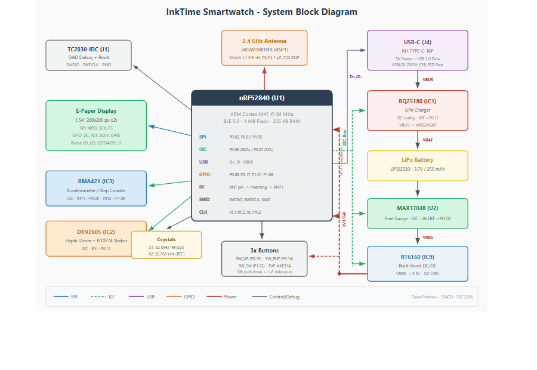
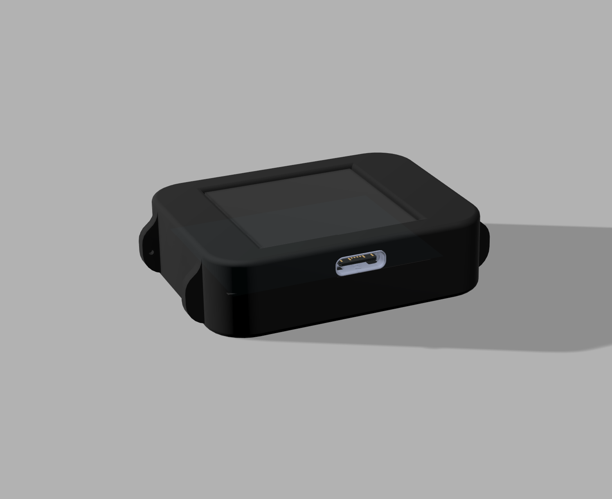
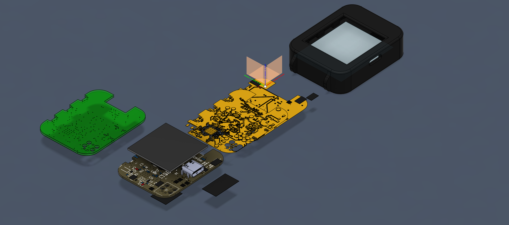
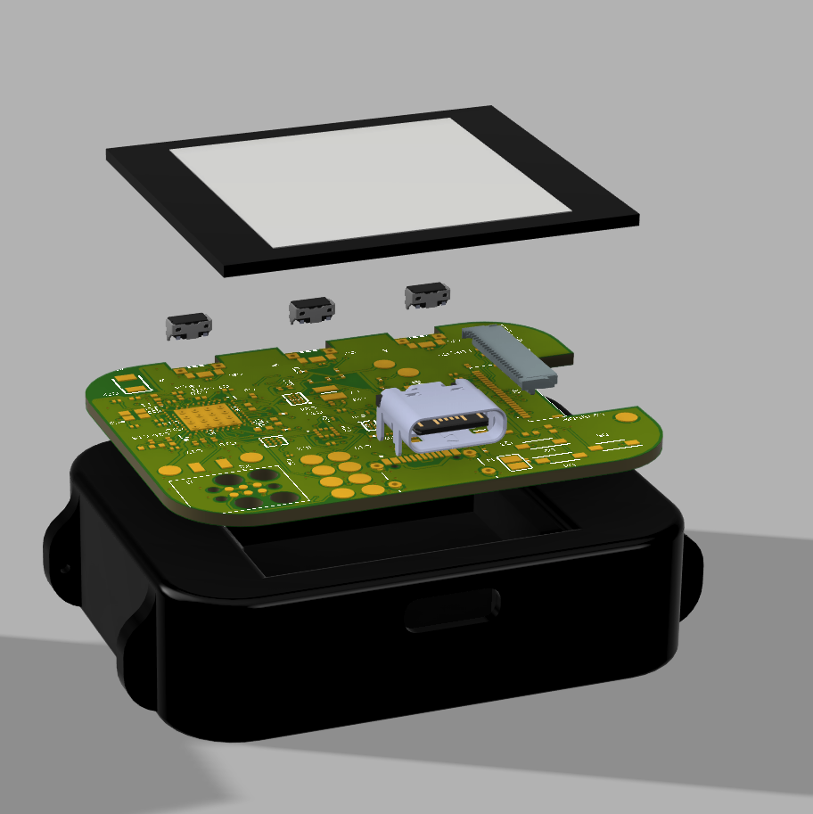

# InkTime Smartwatch

**Student:** Cesar Petrescu  
**Group:** 334CD  
**Course:** Testarea Sistemelor de Calcul - Proiect 2026

## Project Overview

This repository contains the complete hardware design for the InkTime smartwatch project.

The watch is built around the Nordic nRF52840 and combines BLE connectivity, an e-paper display, IMU-based motion sensing, USB-C charging, a fuel gauge, a haptic motor driver, and a buck-boost power stage that generates a stable 3.3 V rail from the battery / charger system rail.

## Block Diagram

## Renders and Mechanical Integration

## Repository Outputs

| Directory | File | Purpose |
|---|---|---|
| `Hardware` | `project-tsc.sch` | Fusion 360 / EAGLE schematic source |
| `Hardware` | `project-tsc.brd` | Fusion 360 / EAGLE PCB source |
| `Hardware` | `schema.pdf` | Schematic print-out for review |
| `Manufacturing` | `gerbers.zip` | Gerber manufacturing archive |
| `Manufacturing` | `InkTime.bom` | Assembly Bill of Materials exported from the board |
| `Manufacturing` | `project-tsc.cpl` | Pick and Place / component placement file |
| `Mechanical` | `Exploded.step` | Complete device STEP model in exploded view |
| `Mechanical` | `Closed.step` | Complete device STEP model in closed/assembled view |

## Design BOM Summary

The assembly-ready BOM exported from the board is included in `Manufacturing/InkTime.bom`. The table below repeats the relevant manufacturing data from that file so the design can be reviewed directly from this README.

### Main fitted parts

| Ref | MPN / Value | Qty | Package / footprint | LCSC / procurement | Function | Datasheet / reference |
|---|---|---:|---|---|---|---|
| U1 | NRF52840-QIAA-R | 1 | AQFN50P700X700X85 HS-74N | [C190794](https://www.lcsc.com/product-detail/C190794.html) | Main MCU, BLE radio, USB device | [Nordic product specification](https://docs-be.nordicsemi.com/bundle/nRF52840_PS_v1.8/raw/resource/enus/nRF52840_PS_v1.8.pdf) |
| IC1 | BQ25180YBGR | 1 | BGA8C40P2X4 100X155X50 | [C3682423](https://www.lcsc.com/product-detail/C3682423.html) | Li-ion charger, power path, ship mode | [TI datasheet](https://www.ti.com/lit/ds/symlink/bq25180.pdf) |
| IC9 | RT6160AWSC | 1 | BGA15C40P3X5 140X230X60 | [C7065276](https://www.lcsc.com/product-detail/C7065276.html) | 3 A buck-boost regulator for 3V3 | [Richtek datasheet](https://www.richtek.com/assets/product_file/RT6160A/DS6160A-05.pdf) |
| U2 | MAX17048G+T10 | 1 | SON50P200X200X80-9N | [C89903](https://www.lcsc.com/product-detail/C89903.html) | Battery fuel gauge | [Analog Devices datasheet](https://www.analog.com/media/en/technical-documentation/data-sheets/max17048-max17049.pdf) |
| IC3 | BMA421 | 1 | BMA423 / LGA-12 | [C5242966](https://www.lcsc.com/product-detail/C5242966.html) | Low-power accelerometer / step counter | [Bosch datasheet](https://www.bosch-sensortec.com/media/boschsensortec/downloads/datasheets/bst-bma421-ds000.pdf) |
| IC2 | DRV2605YZFR | 1 | BGA9C50P3X3 144X144X62 | [C81079](https://www.lcsc.com/product-detail/C81079.html) | Haptic driver for ERM/LRA motor | [TI datasheet](https://www.ti.com/lit/ds/symlink/drv2605.pdf) |
| ANT1 | 2450AT18B100E | 1 | ANTC3216X140N | [C155086](https://www.lcsc.com/product-detail/C155086.html) | 2.4 GHz chip antenna | [Johanson datasheet](https://www.johansontechnology.com/datasheets/2450AT18B100/2450AT18B100.pdf) |
| J4 | KH-TYPE-C-16P | 1 | KINGHELM KH-TYPE-C-16P | [C2765186](https://www.lcsc.com/product-detail/C2765186.html) | USB-C receptacle for VBUS and USB 2.0 data | [JLCPCB part page](https://jlcpcb.com/partdetail/KH-TYPE-C-16P/C2765186) |
| D3 | USBLC6-2SC6Y | 1 | SOT95P280X145-6N | [C7519](https://www.lcsc.com/product-detail/C7519.html) | USB ESD protection | [ST datasheet](https://www.st.com/resource/en/datasheet/usblc6-2.pdf) |
| J2 | 503480-2400 | 1 | 503480-2400 5034802400 | [C132354](https://www.lcsc.com/product-detail/C132354.html) | 24-pin 0.5 mm FPC connector for e-paper | [Molex product page](https://www.molex.com/en-us/products/part-detail/5034802400) |
| J1 | TC2030-IDC | 1 DNP | TC2030IDC | Tag-Connect / DNP footprint | SWD programming and debug footprint | [Mechanical drawing](https://www.digikey.com/en/htmldatasheets/production/2094274/0/0/1/tc2030-idc.html) |
| SW_UP, SW_ENT, SW_DN | EVP-AKE31A | 3 | EVP-AKE31A PAN | [C220990](https://www.lcsc.com/product-detail/C220990.html) | Side tactile buttons | [Panasonic product page](https://industry.panasonic.com/global/en/products/control/switch/light-touch/number/evpake31a) |
| D2, D4, D5 | MBR0530T1G | 3 | SOD3716X135N | [C14156](https://www.lcsc.com/product-detail/C14156.html) | E-paper boost Schottky diodes | [onsemi datasheet](https://www.onsemi.com/pdf/datasheet/mbr0530t1-d.pdf) |
| Q1 | DMG2305UX-7 | 1 | SOT-23 | [C7418](https://www.lcsc.com/product-detail/C7418.html) | P-MOSFET display power gate | [Diodes Inc datasheet](https://www.diodes.com/assets/Datasheets/DMG2305UX.pdf) |
| Q3 | SI1308EDL-T1-GE3 | 1 | SOT-323 | [C146997](https://www.lcsc.com/product-detail/C146997.html) | N-MOSFET display driver switch | [Vishay datasheet](https://www.vishay.com/docs/63399/si1308edl.pdf) |
| X1 | X322532MSB4SI, 32 MHz | 1 | XTAL 2016 N | [C9002](https://www.lcsc.com/product-detail/C9002.html) | Main high-frequency crystal | [LCSC reference](https://www.lcsc.com/product-detail/C9002.html) |
| X2 | X322532768KHZ, 32.768 kHz | 1 | XTAL 3215 N | [C32346](https://www.lcsc.com/product-detail/C32346.html) | Low-frequency RTC crystal | [LCSC reference](https://www.lcsc.com/product-detail/C32346.html) |
| Battery | LP502030, 3.7 V, 250 mAh | 1 | Custom 3D model | [TME product page](https://www.tme.eu/ro/details/accu-lp502030_cl/acumulatori/cellevia-batteries/l502030/) | Main LiPo energy source | [AKYGA LP502030 datasheet](https://www.tme.eu/Document/b9e12bf26ad0ba929a22ab5d58f022cd/AKY0106.pdf) |
| Display | Waveshare 1.54 inch e-paper, 200x200 | 1 | Custom 3D model + J2 FPC | [TME product page](https://www.tme.eu/en/details/wsh-12561/e-paper/waveshare/12561/) | Main user display | [Specification PDF](https://www.tme.eu/Document/0ca57a8ffbcd57b5bca53252eb9d6ec3/WSH-12561.pdf) |
| Motor | FIT0774 | 1 | Custom 3D model / direct wiring | [TME product page](https://www.tme.eu/ro/details/df-fit0774/motoare-dc/dfrobot/fit0774/) | Vibration motor for haptics | [DFRobot product page](https://www.dfrobot.com/product-2297.html) |

### Inductors and passive fitted parts

| Ref | Value / MPN | Qty | Footprint | LCSC / procurement | Notes |
|---|---|---:|---|---|---|
| L1 | LQG15HS3N9S02D, 3.9 nH | 1 | RESC0402 L | [C1581](https://www.lcsc.com/product-detail/C1581.html) | RF matching network |
| L2 | SDFL1005S100KTF, 10 uH | 1 | RESC0402 L | [C1046](https://www.lcsc.com/product-detail/C1046.html) | E-paper power stage |
| L3 | LQG15HS15NJ02D, 15 nH | 1 | RESC0402 L | [C1588](https://www.lcsc.com/product-detail/C1588.html) | RF matching network |
| L5 | 68 uH generic chip inductor | 1 | RESC0402 L | Custom / verify before order | E-paper boost inductor |
| L7 | FTC252012SR47MBCA, 0.47 uH | 1 | INDC2016X100N | [C5832368](https://www.lcsc.com/product-detail/C5832368.html) | RT6160 buck-boost inductor |
| C1-ED-DR | 10 uF, CL05A106MQ5NUNC | 1 | RESC0402 N | [C19702](https://www.lcsc.com/product-detail/C19702.html) | E-paper bulk capacitor |
| C1, C2, C17, C18 | 12 pF, CL03C120JA3NNNC | 4 | RESC0201 L | [C1551](https://www.lcsc.com/product-detail/C1551.html) | Crystal load capacitors |
| C2-EP-DR, C6, C20, C21 | 4.7 uF, CL05A475KQ5NQNC | 4 | RESC0402 N | [C19666](https://www.lcsc.com/product-detail/C19666.html) | Power decoupling / display rail |
| C3, C4 | 1 pF, CL03C010CA3GNNC | 2 | RESC0201 N | [C1546](https://www.lcsc.com/product-detail/C1546.html) | RF matching capacitors |
| C5, C7, C8, C12, C19, C23, C27, C34, C42 | 100 nF / 0.1 uF, CL03A104KA3NNNC | 9 | 0201 variants | [C1525](https://www.lcsc.com/product-detail/C1525.html) | Local decoupling capacitors |
| C9 | 820 pF, CL03B821KO3NNNC | 1 | RESC0201 N | [C3014407](https://www.lcsc.com/product-detail/C3014407.html) | Support capacitor |
| C11 | 100 pF, CL03C101JA3NNNC | 1 | RESC0201 L | [C1555](https://www.lcsc.com/product-detail/C1555.html) | Support capacitor |
| C14, C43 | 4.7 uF, CL03A475KQ3CSNC | 2 | RESC0201 L | [C15850](https://www.lcsc.com/product-detail/C15850.html) | Local bulk capacitors |
| C15 | 1.0 uF, CL03A105KQ3NNNC | 1 | RESC0201 L | [C15849](https://www.lcsc.com/product-detail/C15849.html) | Support capacitor |
| C16 | 47 nF, CL03B473KO3NNNC | 1 | RESC0201 L | [C106094](https://www.lcsc.com/product-detail/C106094.html) | Support capacitor |
| C24, C39 | 10 uF, CL03A106MQ3CSNC | 2 | RESC0201 L | [C19702](https://www.lcsc.com/product-detail/C19702.html) | Power rail capacitors |
| C25, C33 | 22 uF, CL03A226MP3CSNC | 2 | RESC0201 L | [C29777](https://www.lcsc.com/product-detail/C29777.html) | 3V3 bulk capacitors |
| C29, C30, C31, C32, C37, C38 | 1 uF, CL03A105KQ3NNNC | 6 | CAPC0201X13N | [C15849](https://www.lcsc.com/product-detail/C15849.html) | Button debounce / local support |
| EDP_C1, EDP_C2 | 1 uF, CL03A105KQ3NNNC | 2 | RESC0201 L | [C15849](https://www.lcsc.com/product-detail/C15849.html) | E-paper driver capacitors |
| EDP_C5 | 0.1 uF / 50 V, CL03A104KA3NNNC | 1 | RESC0201 L | [C1525](https://www.lcsc.com/product-detail/C1525.html) | E-paper driver capacitor |
| EDP_C6, EDP_C7, EDP_C8, EDP_C9, EDP_C10, EDP_C11, EDP_C12 | 1 uF / 50 V, CL03A105KQ3NNNC | 7 | RESC0201 L | [C15849](https://www.lcsc.com/product-detail/C15849.html) | E-paper charge pump capacitors |
| R1, R2, R3 | 0 ohm, 0201WMJ000XT5E | 3 | 0201 | [C17168](https://www.lcsc.com/product-detail/C17168.html) | Configuration / strap resistors |
| R1_EP_DR1 | 0.47 ohm, 0201WMF4700TCE | 1 | 0201 | [C222406](https://www.lcsc.com/product-detail/C222406.html) | Display driver current path |
| R1_USB, R2_USB | 5.1 k, 0201WMF5101TCE | 2 | 0201 | [C25905](https://www.lcsc.com/product-detail/C25905.html) | USB-C CC pull-down resistors |
| R2_EP_DR, R5, R7, R8, R9, R_PWR_EPD | 10 k, 0201WMF1002TCE | 6 | 0201 | [C25804](https://www.lcsc.com/product-detail/C25804.html) | Pull resistors / display control |
| R17, R18 | 3.3 k, 0201WMF3301TCE | 2 | 0201 | [C25890](https://www.lcsc.com/product-detail/C25890.html) | I2C pull-up resistors |
| R_TYPE_SEL | 2.2 ohm, 0201WMJ0220TCE | 1 | 0201 | [C31998](https://www.lcsc.com/product-detail/C31998.html) | Haptic driver type select |

### DNP / not assembled

| Ref | Quantity | Purpose |
|---|---:|---|
| SJ1 | 1 | Solder jumper / programming footprint |
| TP_3V3, TP_3V3_2, TP_BAT_GND, TP_GND, TP_ON, TP_OP, TP_RESET, TP_SCL, TP_SDA, TP_SWDCLK, TP_SWDIO, TP_SWO, TP_VBAT, TP_VREG | 14 | Test pads, no component assembled |
| C10, C13, C22 | 3 | Not connected / tuning DNP capacitors |
| J1 | 1 | TC2030-IDC debug footprint, not assembled as a normal connector |

### Passives and support parts

- All resistors in the assembly BOM use 0201 footprints.
- The passive packages, values, quantities, and LCSC order codes are listed explicitly in the table above.
- Test pads and debug-only assembly aids are marked as DNP so they are visible during review but not placed as fitted components.

## Hardware Architecture and Functionality

### 1. MCU and RF subsystem

The central controller is the **nRF52840**. It provides:

- ARM Cortex-M4F running at 64 MHz
- BLE radio in the 2.4 GHz ISM band
- full-speed USB device support
- SPI, I2C, GPIO, ADC, and SWD interfaces
- enough Flash and RAM for the smartwatch firmware stack

The RF feed uses the nRF52840 ANT pin, a discrete matching network, and the Johanson **2450AT18B100E** chip antenna.

The antenna section follows the project constraints:

- antenna placed toward the PCB edge
- no routing below the antenna
- no GND pour below the antenna

Clocking is split between:

- **X1 32 MHz** for the main system
- **X2 32.768 kHz** for RTC and low-power timing

### 2. Power path

The power tree is:

`USB-C VBUS -> BQ25180 charger / power-path -> VREG -> RT6160 buck-boost -> 3V3 rail`

Battery monitoring is handled in parallel by the MAX17048 fuel gauge.

#### Charger

**IC1 BQ25180YBGR** receives VBUS from USB-C and manages battery charging, ship mode, and the regulated system path. Its interrupt line is exposed to the MCU as `PMIC_INT`.

#### Buck-boost regulator

**IC9 RT6160AWSC** converts the system rail to a stable 3.3 V output used by the MCU and peripherals. The design uses L7 and the required input and output capacitors from the reference schematic.

#### Fuel gauge

**U2 MAX17048G+T10** monitors the battery and exposes an alert output to the MCU. This gives the firmware a direct low-battery interrupt path.

### 3. Display subsystem

The display is a **1.54 inch 200x200 Waveshare e-paper panel** connected through **J2**, a 24-pin 0.5 mm FPC connector.

Interface signals:

- SPI clock: `SCK`
- SPI data: `MOSI`
- Chip select: `EPD_CS`
- Control GPIOs: `EPD_DC`, `EPD_RST`, `EPD_BUSY`

### 4. Motion sensing

**IC3 BMA421** is the accelerometer used for motion sensing, step counting, and interrupt-driven wake-up.

It is connected on the shared I2C bus and exposes two interrupt pins:

- `IMU_INT1`
- `IMU_INT2`

This lets the firmware wake the system on motion-related events without polling continuously.

### 5. Haptic feedback

**IC2 DRV2605YZFR** drives the **FIT0774** vibration motor.

It is controlled over I2C and uses an enable signal from the MCU. The output nodes are also broken out to test pads, which simplifies debugging and rework.

### 6. USB-C and ESD protection

**J4** is the USB-C connector used for power input and USB data.

- `VBUS` feeds the charger input
- `D+` and `D-` go to the nRF52840 USB interface
- `R1_USB` and `R2_USB` are 5.1 k pull-down resistors on the CC pins
- `D3 USBLC6-2SC6Y` protects the USB lines against ESD events

### 7. Debug and bring-up

**J1 TC2030-IDC** provides the SWD programming and debug interface.

The following debug / bring-up signals are also available on dedicated test pads:

- `TP_3V3`
- `TP_3V3_2`
- `TP_VREG`
- `TP_VBAT`
- `TP_BAT_GND`
- `TP_GND`
- `TP_SDA`
- `TP_SCL`
- `TP_SWDIO`
- `TP_SWDCLK`
- `TP_SWO`
- `TP_RESET`
- `TP_OP`
- `TP_ON`

### 8. User interface

The watch uses three side buttons:

- `SW_UP`
- `SW_ENT`
- `SW_DN`

Each button is connected to a GPIO input and paired with a pull resistor and a 1 uF capacitor for debounce.

## nRF52840 Pin Usage

| nRF pin | Signal | Connected block | Reason |
|---|---|---|---|
| P0.00 / XL1 | XL1 | X2 32.768 kHz crystal | RTC clock input |
| P0.01 / XL2 | XL2 | X2 32.768 kHz crystal | RTC clock output |
| XC1 / XC2 | XC1 / XC2 | X1 32 MHz crystal | Main HF clock for MCU and radio |
| P0.02 | SCK | E-paper connector J2 | SPI clock for display |
| P0.03 | MOSI | E-paper connector J2 | SPI data for display |
| P0.05 | EPD_CS | E-paper connector J2 | Display chip select |
| P0.06 | SDA | IC1, IC2, IC3, U2, IC9 through links | Shared I2C data |
| P0.07 | SCL | IC1, IC2, IC3, U2, IC9 through links | Shared I2C clock |
| P0.08 | IMU_INT1 | BMA421 | Motion / wake interrupt |
| P0.10 | ALERT | MAX17048 | Battery alert interrupt |
| P0.11 | PMIC_INT | BQ25180 | Charger / power-path interrupt |
| P0.12 | HAPTIC_EN | DRV2605 | Enables haptic driver |
| P0.13 | SW_UP | User button | Navigation input |
| P0.14 | SW_ENT | User button | Confirm / enter input |
| P0.15 | EPD_DC | E-paper connector J2 | Display data / command select |
| P0.16 | EPD_RST | E-paper connector J2 | Display reset |
| P0.17 | EPD_BUSY | E-paper connector J2 | Display busy indication |
| P0.18 / RESET | RESET | SWD header J1 and TP_RESET | Hardware reset |
| P1.00 | SWO | SWD header J1 and TP_SWO | Debug trace output |
| P1.01 | P1.01 / EPD_GATE | Q1 gate control | Power gates the display rail |
| P1.02 | SW_DN | User button | Navigation input |
| P1.08 | IMU_INT2 | BMA421 | Secondary motion / gesture interrupt |
| D+ / D- | USB D+ / D- | D3 and J4 | USB data |
| VBUS | VBUS detect | J4 / charger path | USB power sense |
| ANT | RF output | Matching network and ANT1 | BLE antenna feed |
| SWDIO | SWDIO | J1 and TP_SWDIO | SWD data |
| SWDCLK | SWDCLK | J1 and TP_SWDCLK | SWD clock |

## Power Budget and Battery-Life Estimation

The selected battery is the **LP502030 LiPo, 3.7 V / 250 mAh**. The estimate below uses typical planning currents from the component datasheets and an assumed light smartwatch workload. Final current must be measured on physical hardware because BLE interval, display refresh rate, haptic usage, firmware sleep state, and DC/DC efficiency dominate the result.

Assumed daily usage profile:

- BLE advertising / light connection duty cycle active through the day
- BMA421 left in low-power interrupt mode
- e-paper refreshed 12 times per hour, 2 s per refresh
- haptic motor used 20 times per day, 200 ms per event
- display rail switched off by Q1 between refreshes
- 20% system margin added for regulator loss, leakage, firmware overhead, and component tolerance

| Block / mode | Typical current while active | Duty cycle assumption | Average current contribution |
|---|---:|---:|---:|
| nRF52840 sleep + RTC base | 0.003 mA | Always on | 0.003 mA |
| nRF52840 BLE radio events | 5.0 mA during TX/RX bursts | Low-duty BLE average | 0.080 mA |
| BMA421 accelerometer | 0.014 mA | Low-power motion detect | 0.014 mA |
| MAX17048 fuel gauge | 0.023 mA | Always on | 0.023 mA |
| BQ25180 charger / power-path leakage | 0.001 mA | Battery mode | 0.001 mA |
| RT6160 buck-boost quiescent and light-load loss | 0.006 mA | Always on | 0.006 mA |
| E-paper standby with rail gated | 0.001 mA | Between refreshes | 0.001 mA |
| E-paper refresh | 8.0 mA | 2 s x 12 refreshes / hour | 0.053 mA |
| DRV2605 + FIT0774 haptic event | 80 mA | 20 x 0.2 s / day | 0.004 mA |
| Buttons and static GPIOs | ~0 mA | No button held | ~0 mA |
| Estimated subtotal |  |  | **0.185 mA** |
| 20% design margin |  |  | **0.037 mA** |
| Estimated average current |  |  | **0.222 mA** |

Battery-life estimate:

`Battery life [hours] = battery capacity [mAh] / average current [mA]`

`250 mAh / 0.222 mA = 1126 h = 46.9 days`

Scenario comparison:

| Scenario | Average current | Estimated life | Approximate duration |
|---|---:|---:|---:|
| Light use, interrupt-driven firmware | 0.222 mA | 1126 h | ~46.9 days |
| More frequent BLE/display updates | 0.5 mA | 500 h | ~20.8 days |
| Heavy use / development firmware | 1.0 mA | 250 h | ~10.4 days |
| Mostly active peripherals | 2.0 mA | 125 h | ~5.2 days |

Low-power decisions used in this design:

- the e-paper rail is gated through Q1, so the display does not remain fully powered between refreshes
- the BMA421 can wake the MCU through `IMU_INT1` / `IMU_INT2`, avoiding continuous polling
- the MAX17048 `ALERT` line gives a low-battery interrupt path
- the 32.768 kHz crystal allows accurate RTC timing in low-power modes
- the haptic motor is event-based and has a very small daily average current despite high instantaneous current

## Validation Notes

The board was routed against the project constraints and JLCPCB manufacturing limits:

- PCB stack target: 4 layers with component placement only on Top
- board thickness target: 1.0 mm, matching the project mechanical requirement
- power rails such as `VBUS`, `VREG`, `VBAT`, `3V3`, and `EPD_3V3` routed with 0.3 mm target width where there is enough clearance
- BGA escape and dense IC breakouts use narrower local segments only where required by package geometry
- signal traces use at least 0.15 mm width
- no intentional right-angle routing
- GND copper present on Top and Bottom, with an internal GND reference plane
- via stitching used between GND regions, especially around the nRF52840 RF section
- antenna placed at the outside PCB edge, with no copper pour or signal routing under the antenna keepout
- decoupling capacitors placed next to the supply pins of the MCU, PMIC, regulator, IMU, fuel gauge, haptic driver, and display power stage
- silkscreen is kept to readable component names and clear test-pad labels

ERC / DRC review notes:

- The course-permitted ERC warning `Only INPUT pins on NET ID` is acceptable.
- Dimension warnings caused by the side buttons and USB-C connector are acceptable when caused by mechanical alignment with the case.
- The final manufacturing archive is exported as `Manufacturing/gerbers.zip`.
- The final BOM and Pick and Place files are `Manufacturing/InkTime.bom` and `Manufacturing/project-tsc.cpl`.

### Target PCB rules

- 4-layer PCB (Top, Inner 1, Inner 2, Bottom)
- all components placed on the **Top** layer
- routing allowed on **Top**, **Inner 2**, and **Bottom**
- **Inner 1** is a dedicated GND plane
- GND pour also present on **Top** and **Bottom**
- PCB thickness set to **1.0 mm**
- power traces targeted at **0.3 mm**
- signal traces targeted at **0.15 mm minimum**
- no right-angle tracks
- no copper and no routing below the antenna
- via stitching to the inner GND plane, especially around the RF area

### Placement strategy

The placement follows the course board-shape reference and groups components around the main ICs:

- U1 and the RF matching network near the antenna edge
- IC1, U2, and J4 grouped in the USB / charging area
- IC9, L7, and bulk caps grouped as the 3.3 V power stage
- J2 and the E-paper boost parts grouped together
- IC3 placed close to the MCU while staying away from the antenna keepout area
- IC2 placed close to the haptic output pads and motor connection path

## Design Log

- Started from the course-provided InkTime schematic and mechanical outline.
- Initially targeted a 2-layer stack, but pivoted to a 4-layer stack because routing was significantly easier and required fewer vias thanks to the additional routing layers and the dedicated inner GND plane.
- Grouped the major components by subsystem to make routing, review, and mechanical integration easier.

## References
- Reference schematic: <https://ocw.cs.pub.ro/courses/_media/tsc/inktime_schematic.pdf>
- nRF52840 product page: <https://www.nordicsemi.com/Products/nRF52840>
- BQ25180 product page: <https://www.ti.com/product/BQ25180>
- DRV2605 product page: <https://www.ti.com/product/DRV2605>
- MAX17048 product page: <https://www.analog.com/en/products/max17048.html>
- EVPAKE31A product page: <https://industry.panasonic.com/global/en/products/control/switch/light-touch/number/evpake31a>

## License

This repository uses the license defined in the root `LICENSE` file.
